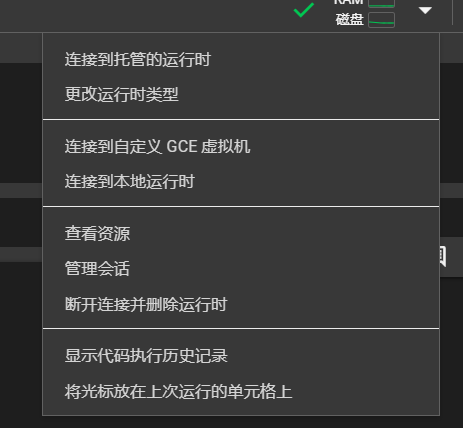
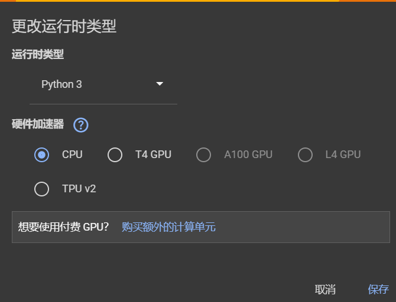

# Colab入门
---
***参考资料**：
- [从零开始的colab教程](https://colab.research.google.com/drive/)
- [Colab学习经验](https://blog.csdn.net/qq_51302564/article/details/115605994)
- [colab无敌详细教程](https://blog.csdn.net/sciws/article/details/124739341)

## 什么是Colab
Colaboratory 是一个免费的 Jupyter 笔记本环境，不需要进行任何设置就可以使用，并且完全在云端运行。
借助 Colaboratory，可以编写和执行代码、保存和共享分析结果，以及利用强大的计算资源，所有这些都可通过浏览器免费使用。

- 免费访问计算资源：用户可以免费使用Colab提供的GPU和TPU，这对于机器学习和深度学习等需要大量计算资源的任务非常有用。

- 云服务：作为一个在线服务，用户无需在本地计算机上安装和配置环境，可以直接在浏览器中编写和运行代码。

- 协作功能：Colab支持实时协作，多个用户可以同时编辑同一个Notebook，非常适合团队合作。

- 版本控制：Colab与GitHub集成，用户可以轻松地将Notebook与GitHub仓库同步。

- 易于分享：用户可以通过链接与他人分享Notebook，分享的链接可以设置为“查看”或“编辑”模式。

- 集成数据存储：Colab可以轻松地与Google Drive等云存储服务集成，方便用户存储和访问数据。

- 丰富的库支持：Colab预装了许多常用的Python库，如NumPy、Pandas、TensorFlow和PyTorch等，用户也可以根据需要安装其他库。

- 界面友好：Colab提供了一个用户友好的界面，包括代码单元、Markdown单元以及代码执行和调试工具。

## 如何使用Colab
需要两样东西
- 谷歌账号
- 科学上网

[Colab主页](https://colab.research.google.com/drive/)
### 使用Colab的方式

- 点击左下角新建笔记本

- 在一些仓库的主页找到Colab直接打开
## 使用方法
### 文件格式
Colab打开的一般文件格式是ipynb，也就是Jupyter Notebook 使用的文件格式优点在于可以将代码，文档和结果整合在一个文件当中，方便分享和复现分析过程。
### 如何使用colab的GPU

点击上方菜单栏中Gemini中的小三角

选择更改运行时类型

这里三种可用的免费资源，cpu可24小时使用，其余的每日可使用12小时，一般是每日中午12点左右刷新时长，所以要记得在使用时间结束前将训练任务完成
### ipynb特点
你可以把.ipynb 看成linux命令行，使用系统命令时，前面加 %，调用程序，前面加！
### 将colab挂载到谷歌云盘
```
import os
from google.colab import drive
drive.mount("/content/drive")
```
或者

点击左侧文件夹图标后点击第三个图标
### 防止断连
```
function ClickConnect(){
console.log("Working"); 
document.querySelector("colab-toolbar-button#connect").click()
}
setInterval(ClickConnect,60000)
```
### 如何上传数据集
将数据集打包好压缩上传到colab，再对压缩包进行解压缩
### 如何与他人协作编辑colab
点击页面右上角的“Share”按钮。复制当前Notebook的链接
在分享对话框中，选择“Link sharing”选项，并设置权限为“Anyone with the link can view”（任何人都可以通过链接查看）或“Anyone with the link can edit”（任何人都可以通过链接编辑）
将连接分享给协作者后，便可以实时查看或编辑该notebook
